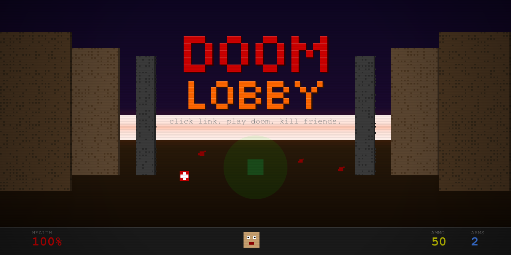

# DOOM Lobby

<p align="center">
  
</p>

<p align="center">
  <em>It's 2026 and you still need a LAN party to play multiplayer DOOM?</em><br>
  <strong>Not anymore.</strong> Send a link. Open a browser. Frag your friends.
</p>

---

Zero downloads. Zero accounts. Zero excuses. One Cloudflare Worker, one Durable Object, and the same netcode id Software shipped in 1993 — except the LAN is now Cloudflare's backbone across 300+ cities.

## Quick Start

### Play

```bash
npm install
make setup          # fetches shareware WAD + builds WASM engine
make dev            # localhost:8787
```

Click **HOST DEATHMATCH**. Copy the link. Send it to up to 3 friends. Click **START**. That's the whole product.

### Deploy (it's free)

```bash
npx wrangler login  # one-time Cloudflare auth
make deploy
```

Congrats, you now run a DOOM server on the edge. Tell your boss it's "distributed systems research."

## How It Works

```
/                    solo — just you and the demons
/play                creates a lobby, redirects to ↓
/play/xk7f3n         the lobby — share this URL, everyone who opens it joins
```

Hit `/play`. Get a waiting room with a share link, QR code, and live player list. Friends open the same URL. Host picks deathmatch or co-op, clicks START, and DOOM's 1993 lockstep netcode handles the rest over WebSockets.

```
  Browsers                                   Cloudflare Edge
                                            +-----------------------------+
 +-----------------+                        |                             |
 |  DOOM (WASM)    |  <--- WebSocket --->   |  +~~~~~~~~~~~~~~~~~~~~~~~+  |
 |  full 60fps     |                        |  |                       |  |
 +-----------------+                        |  |  DoomLobby            |  |
                                            |  |  (Durable Object)     |  |
 +-----------------+                        |  |                       |  |
 |  DOOM (WASM)    |  <--- WebSocket --->   |  |  - 4 WebSockets       |  |
 |  same lobby URL |                        |  |  - relay binary pkts  |  |
 +-----------------+                        |  |  - route by fake IP   |  |
                                            |  |                       |  |
 +-----------------+                        |  +~~~~~~~~~~~~~~~~~~~~~~~+  |
 |  DOOM (WASM)    |  <--- WebSocket --->   |                             |
 |  another friend |                        |   Static: HTML, WASM, WAD   |
 +-----------------+                        +-----------------------------+
```

Each client runs the full engine. The Durable Object is just a dumb packet relay — reads an 8-byte header, strips the destination, forwards to the right socket. No game logic on the server. id Software figured that out 33 years ago.

## What's in the Box

| | |
|---|---|
| **Worker** | ~320 lines TypeScript — lobby creation, WebSocket upgrade, reconnection, chat relay |
| **Frontend** | ~800 lines — single HTML file with lobby UI, DOOM canvas, mobile touch controls, kill feed |
| **Engine** | Chocolate Doom → WASM via Emscripten, WebSocket net driver |
| **Max players** | 4 (DOOM's original limit — blame id, not us) |
| **State** | In-memory only. No database. Lobby dies when everyone leaves. |
| **Cost** | Free tier. Yes, really. |

## Features

- **Lobby URL is the invite** — no room codes, no matchmaking, no friction
- **QR code sharing** — scan from your phone (mobile touch controls included)
- **Deathmatch or Co-op** — host picks the mode
- **Lobby chat** — trash talk before the carnage begins
- **Player join sounds** — you'll hear them coming
- **Kill feed overlay** — see who fragged who in real time
- **Reconnection grace period** — WiFi blip? 10 seconds to rejoin
- **Lobby full enforcement** — 5th player gets a polite rejection
- **Auto-cleanup** — idle lobbies time out, Durable Objects get evicted
- **Loading progress** — know how much WAD you have left to download

## Building the WASM Engine

The engine is [cloudflare/doom-wasm](https://github.com/cloudflare/doom-wasm) — Chocolate Doom with UDP ripped out and a WebSocket driver patched in. You need [Emscripten](https://emscripten.org/):

```bash
# one-time: install Emscripten
git clone https://github.com/emscripten-core/emsdk.git
cd emsdk && ./emsdk install latest && ./emsdk activate latest
source ./emsdk_env.sh

# build (clones the repo, compiles, copies artifacts to public/)
make build-wasm
```

First build takes ~10-15 min (you're compiling a 1993 game engine to WebAssembly — give it a moment). After that it's fast.

## All Commands

| Command | What it does |
|---------|-------------|
| `make dev` | Local dev server |
| `make deploy` | Ship it to the edge |
| `make setup` | Fetch WAD + build WASM |
| `make build-wasm` | Compile DOOM to WASM |
| `make fetch-wad` | Download `doom1.wad` (shareware, legal, don't worry) |
| `make types` | TypeScript type check |
| `make clean` | Nuke build artifacts |

## Standing On

- [cloudflare/doom-wasm](https://github.com/cloudflare/doom-wasm) — the WASM engine and WebSocket net driver
- [cloudflare/doom-workers](https://github.com/cloudflare/doom-workers) — the original Durable Objects relay (we rewrote it, sorry Cloudflare)
- [id Software](https://github.com/id-Software/DOOM) — the reason any of this exists

## License

GPL-2.0, inherited from Chocolate Doom and the DOOM source release. John Carmack made this possible by open-sourcing DOOM in 1997. We're just putting it in a browser and adding WebSockets.
